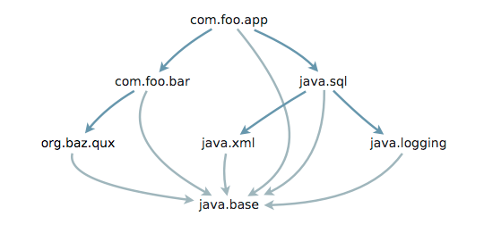
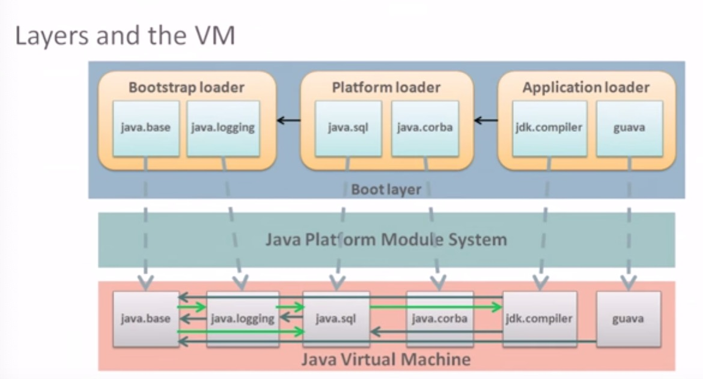
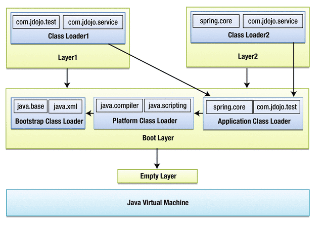

# Java Module System 初探
转眼马上2020，JDK 14也要如期而来了，作为还停留在Java 8的码农，是时候了解下Java 9了。Java 9最大的变化就是引入了模块系统，对模块化编程提供了原生的支持，我们该怎么用，它又是怎么实现的？趁阅读完相关的资料还记得，总结一下。

## 为什么
为什么要模块化？简单来说模块化提供了以下2个特性 [1]
1. 可靠配置 (*Reliable configuration*)，模块化代码显式地声明了依赖，这样Java就可以在编译期或者运行启动时就能检查依赖是否能够被满足，不满足则会尽早抛出`java.lang.module.FindException`，避免使用`-classpath`时运行一般会抛出`java.lang.NoClassDefFoundError`的尴尬，而且如果`-classpath`中存在多个版本的jar，JVM运行时使用哪个jar中的类不可预知，带来了隐患。模块系统规定，在一个解析好的模块依赖图中，不用模块包含不同包名，同一个包名不能出现在不同模块中。
2. 强封装 (*Strong encapsulation*)，Java 8中使用public修饰的类能够被任意地访问，而Java 9中，只有显式导出(`exports`)的public类才能被访问，public修饰符添加了module维度的限制。
显式声明依赖和强封装，带来了另一个好处，就是JVM能够快速定位到类所在的模块，而不需要遍历扫描`-classpath`中所有的jar文件。

## 怎么定义一个模块
一个模块其实就是带了模块声明(*module declaration*)的普通的jar包，在`module-info.java`中使用模块定义语句声明模块，可以包含以下4个部分:
1. 模块名字
2. 模块依赖哪些模块
3. 哪些包可以被其他模块访问
4. 使用什么服务或者提供什么服务

比如下面声明
```java
module com.foo.bar {
    requires org.baz.qux;
    exports com.foo.bar.alpha;
    exports com.foo.bar.beta;
}
```
定义了一个名为`com.foo.bar`的模块，不同模块的名字不能重复，一般推荐使用包名的命名方式来命名模块，因此自然地模块名可以是导出包名的前缀，但这不是强制的。`requires`指令表明该模块依赖另一个模块`org.baz.qux`，在Java规范中其定义了模块间的`reads`的关系，我们说如果模块a `requires` 模块b，那么模块a*读取*(`reads`)模块b。所有依赖必须显式的声明，除非依赖的模块声明了依赖可以被传递 (即`reqiures transitive`)。比如模块`com.foo.app`依赖`com.foo.bar`，它如果想访问`org.baz.qux`包中的类，必须在模块声明中加上`requires org.baz.qux`尽管它已经被`com.foo.bar`所依赖，除非模块`com.foo.bar`定义了依赖可以被传递(即`requires transitive org.baz.qux`)，`transitive`大大简化了模块的定义，屏蔽了底层模块的依赖关系，在定义自己的模块时，你不需要搞清楚依赖模块的依赖，解放了生成力。默认所有模块隐式(*implicit*)依赖Java基础模块`java.base`。`exports`指令指明了该模块对外暴露的包，只有在这个包名下面的public/protected类才能被其他模块访问，默认暴露所有的包给所有的模块，也可以使用 `export xx to yy,zz`的声明限定暴露的包给模块yy,zz使用。

一个模块`a`可以访问另一个模块`b`中的类`c`必须满足以下两个条件:
- 模块`a`必须读取(`requires`)模块`b`
- 类`c`所在的包必须被模块`b`导出(`exports`)

模块声明文件通常放置在模块源码的根目录，比如：
```java
module-info.java
com/foo/bar/alpha/AlphaFactory.java
com/foo/bar/alpha/Alpha.java
```
文件会被编译成`module-info.class`，打包到jar文件中，运行时，JVM会读取它并验证依赖关系。

类似`-classpath`，Java 9引入了`module-path`，该路径放置模块名或者包含模块的目录，运行时从该路径下查找并加载模块。

## 模块的分类
根据jar包是否包含模块声明，及运行时jar包放置位置，模块被划分成了不同的类型，总结如下：

<table width="400px">
<tr><td></td><td><code>-module-path</code></td><td><code>-classpath</code></td></tr>
<tr><td>模块化Jar</td><td>application module</td><td>unnamed module</td></tr>
<tr><td>非模块化Jar</td><td>automatic module</td><td>unnamed module</td></tr>
</table>

- application module: 也称为named application module。它使用标准的模块开发方式，声明了模块的依赖及对外暴露的包，并且运行时放置在了`module-path`路径下。
- unamed module：没名称的模块，Java 9中`-classpath`并没有去掉(兼容Java 8的运行方式及jar文件)，所有放在`-classpath`中的jar中的包被归类到了unnamed module中，它默认导出(`exports`)所有的包以及读取(`requires`)所有其他模块(这是确保兼容性及方便迁移)。因为这个module没有名称，因此它不能被其他模块所读取（其他模块不能`requires`）。每个`application classloader`默认都有一个unnamed module，可以通过`class.getClassLoader().getUnnamedModule()`获取。
- automatic module: 普通的jar包放在`module-path`中，系统会自动将它转化为为automatic module，它的名字从jar文件名转化而来。它的提出是为了解决app依赖的jar包还没有模块化或者不可能模块化，而app模块化了。如果此时我们将app放在`module-path`上，其他依赖模块放在`-classpath`上，由于模块不能显式`requires` unnamed module，所以程序不能正确地被运行，导致了我们自己own的项目的模块化必须依赖于依赖的模块的模块化，为了解决这个，大牛们提出了automatic module，将普通的jar放置在`module-path`中，这样系统自动构造出一个命名模块，从而我们的app可以声明读取它。automic module默认可以读取其他所有named module和其他的automic module，及导出所有的包。

不同类型的模块有不同的读取属性以及导出属性，总结如下：

<table width="500px">
<tr><td>Module Type</td><td>来源</td><td>Exports</td><td>Reads</td></tr>
<tr><td>(named) platform module</td><td>JDK</td><td>显式指定</td><td>显式指定</td></tr>
<tr><td>(named) application module</td><td><code>module-path</code>中包含<code>module-info.class</code>的jar</td><td>显式指定</td><td>显式指定</td></tr>
<tr><td>automatic module</td><td><code>module-path</code>中没有<code>module-info.class</code>的jar</td><td>所有</td><td>platform
application
automatic</td></tr>
<tr><td>unnamed module</td><td><code>classpath</code>中所有的jar</td><td>所有</td><td>platform
application
automatic</td></tr>
</table>

## 服务
在Java中我们通过使用`java.util.ServiceLoader`来动态加载不同服务的提供方，也就是通常说的SPI机制，通过运行时扫描`-classpath`中的`META-INFO/services`配置文件来动态加载服务。在模块化系统中，我们使用了新的方式来显式地声明服务和服务提供方。 比如：
```java
module java.sql {
    requires public java.logging;
    requires public java.xml;
    exports java.sql;
    exports javax.sql;
    exports javax.transaction.xa;
    uses java.sql.Driver;
}
```
`uses`指令显式指定了模块`java.sql`所需要的服务(当然也是它定义了服务接口)，模块运行时使用`ServiceLoader::load`来动态的获取服务的实现，比如`com.mysql.jdbc`模块实现了服务接口，其定义可以如下:

```java
module com.mysql.jdbc {
    requires java.sql;
    requires org.slf4j;
    exports com.mysql.jdbc;
    provides java.sql.Driver with com.mysql.jdbc.Driver;
}
```
`provides... with...` 指令显式声明了该模块提供了什么服务实现，这样系统就可以直接读取`module-info.java`来确定该模块提供了什么服务实现，这样显式的声明带来了编译时和运行时依赖关系的预先检查好处。

为了方便迁移及兼容原有的jar包，如果automatic module包含了`META-INF/services`配置，则系统默认为模块生成`provides`指令，仿佛就是模块本身声明的一样。

## 反射
Java JDK和很多框架比如(Spring，Hibernate)通常会在运行时使用反射来加载，检查，或者实例化其他类，在Java 9之前由于没有强封装，因此公共类可以自由的访问，但在Java 9中，如果一个类能够被实例化，那么这个类的必须能够被开放访问，也就是满足上述的2个条件(`requires`和`opens`)。一方面自由的访问违反了模块系统的强封装特性，另一方面不开放反射性质，许多现有应用程序将不会迁移到JDK 9上。大佬们这时候提出了open的解决方案。

如果一个module可以是`open`的，那么这个模块中的所有的类型(public，protected，default，private)都可以被反射访问，比如:
```java
open module com.foo.app {
    // Module statements go here
}
```
也可以指定`open`某些包，或者`open`某些包给某些特定的模块。
```java
module com.foo.bar {
    exports com.foo.bar.alpha;
    opens com.foo.bar.beta;
    opens com.foo.bar.omega to hibernate.core;
}
```
上述定义说明了2点 (1) `com.foo.bar.alpha`包中public/protected的类及其public/protected成员可以在编译时，运行时及反射访问; (2) `com.foo.bar.beta`包中的public/protected类及其public/protected成员可以在运行时访问，但编译时不能够访问任何类，并且其所有类都可以被反射访问到。（3）`com.foo.bar.omega`所有类只能模块被`hibernate.core`反射访问，但编译和运行时不能够访问到。

`opens`和`exports`不存在推导关系，也就是说声明了opens的包不会自动被exports。

这就好了吗？ 不对！在服务章节提到的`ServiceLoader`机制及很多基于反射动态查找和实例化类的框架，其大概的工作流程是这样的： 
1. 查找类并加载获取 `Class`对象， 伪代码如下：
```java
Class clazz = Class.forName(name，false,Thread.getContextClassLoader());
```
2. 基于反射创建一个对象，
```java
Object ob = clazz.newInstance();
```
对于第一步，能正常运作，只要classloader知道到哪里去加载class，这个没有问题，因为classloader可以自定义。但第二步却无法执行，因为为了能够实例化对应的类，框架必须能够访问其类的public构造函数，但模块化系统中，访问类的成员必须满足2个条件 (1)显式声明读模块; (2)被读模块的类所在的包必须exports。显式声明读模块和框架的运行时确定产生了本质的冲突，服务是开放给其他人实现的，框架的无法预先知道有哪些实现，更别说事先声明`requires`， 一种解决方式是框架在运行时动态添加读模块，但这个不友好且需要修改现有框架代码。因此JDK开发者重新修正了反射API的实现方式，如果一个模块反射访问某些类型，那么默认这个模块可读被反射类所在的模块。但这并没有削弱强封装性，因为被反射的类所在的包必须被模块所`exports`或者`opens`，才能被反射访问，也就是第二点。

## 类加载器(classLoader)
程序运行时，每个模块都有一个类加载器，多个模块可以共享同一个类加载器，也就是说一个类加载器可以加载多个模块，只要这些模块所含的包名不冲突。从JDK 1.2开始就实现了三层类加载器机制，每一个类加载器先委托父加载器加载类或者资源，如果不能加载，才使用自身加载机制进行加载:
1. application class loader: 继承`java.net.URLClassLoader`，用来加载`classpath`上的jar文件；
2. extension class loader: 也继承`java.net.URLClassLoader`，用来加载通过扩展机制加入的类；
3. bootstrap class loader: vm实现，用来加载Java核心类库。

JDK9仍然保留了三层类加载机制，但做了以下修改:
1. application class loader: 不再继承`java.net.URLClassLoader`，而是继承`jdk.internal.loader.BuiltinClassLoader`，默认用它来加载JDK和JavaSE模块的工具类模块以及`module-path`中的named modules，它首先根据类名解析出包名，根据包名映射到某一个模块，进而找到模块对应的类加载器进行加载类，如果没能映射到某个模块，则会委托给父加载器加载，如果父加载器未能加载该类，则从`-classpath`中查找类，如果找到，则将其加载并归类到`classloader`的unamed module中；
2. platform class loader: 不再继承`java.net.URLClassLoader`，而是继承`jdk.internal.loader.BuiltinClassLoader`。废除了扩展机制来加载类，用来加载JDK与JavaSE的平台模块， 如果没找到对应的模块，则委托给父加载器；
3. bootstrap class loader： 用来加载核心JavaSE和JDK的模块。

## 模块依赖图及层 (Module Graph和Layer)
通过解析模块的依赖关系(`requires`指令)，我们很容易获得模块的依赖关系图，比如：


一个有效的模块图是一个单向无环图，图中的深蓝色箭头表示模块A显式声明读取模块B，浅蓝色箭头是隐式声明的依赖，即所有模块都默认读取`java.base`模块。Java编译器或者JVM确保模块图中的各个模块定义的包名不重复，即一个包不可能同时定义在模块A和模块B，这样的话带来了读取的歧义。但是可以通过部署在不同的模块图中，来加载相同包名的模块。

既然是一个单向图，那么就需要有根节点，根节点的模块被称为根模块(*root modules*)，模块系统通过解析根模块的依赖关系来构建模块图，可以通过命令`----add-modules`显式的添加根模块。

在Java 9中模块是模块层(Module Layer)的形式组织起来的，解析好的模块图在Java中被称为配置，一个配置加上模块类加载器称为模块层：
- Configuration = a module graph
- Module Layer = Configuration + (Module -> Clasloader)

JVM在启动的时候会创建引导层(boot layer)，层与VM的关系如下：


最上面是引导层，每个JVM应用都有且只有一个引导层，在启动的时候JVM构建并解析，加载不用的模块， 其中包含由bootstrap， platform及application 类加载器加载的模块，在构建层的时候不同模块的访问关系通过中间的模块系统告诉VM模块`requires`，`uses`，`opens`等语义，以及记录哪些包属于哪些模块等定位信息。最底层是VM层，根据上层传递的信息来控制模块之间的访问约束。

模块层可以堆叠，两个模块层可以成为父子关系，引导层的父层为空层。一个多层的示例如下：
JVM在启动的时候会创建引导层(boot layer)，层与VM的关系如下：


上图创建了2个自定义图层Layer1和Layer2，它们的父层都是boot layer。堆叠中给定层中的模块可以读取在其下方的层中的模块，也就是说，Layer1和Layer2都可以读取引导层中的模块。 但是，Layer1无法读取Layer2中的模块，因为它们是兄弟层。引导层也不能读取Layer1和Layer2中的模块，因为引导层并不感知上层模块。Layer1和Layer2中的模块使用了不同的类加载器，因此不同版本的模块可以同时被加载到VM中(即图中`com.jdojo.service`模块)。Classloader1和Classloader2都把应用加载器作为了父加载器，使得Layer1和Layer2可以读取下层所有模块，建立模块之间的层次关系。

允许将模块布置成层次形成很多高级特性，这些特性通常在高级Java应用程序（例如作为托管应用程序容器的Java EE应用程序/ Web服务器）中遇到: 比如在容器环境下托管应用程序可以使用模块层来做到模块资源隔离。

> Tips: 层是不可变的。 创建图层后，无法向其中添加模块或从中删除模块。 如果需要添加模块或替换其他版本的模块，则必须拆除图层并重新创建。

## Java API
Java提供了一系列可以操作模块，构建模块层的API，主要集中在`java.lang`及`java.lang.module`包中。

<table>
<thead>
<tr class="header">
<th>类</th>
<th>描述</th>
</tr>
</thead>
<tbody>
<tr class="odd">
<td>Module</td>
<td>表示运行时模块。</td>
</tr>
<tr class="even">
<td>ModuleDescriptor</td>
<td>表示模块描述。 这是不可变类。</td>
</tr>
<tr class="odd">
<td>ModuleDescriptor.Builder</td>
<td>用于以编程方式构建模块描述的嵌套构建器类。</td>
</tr>
<tr class="even">
<td>ModuleDescriptor.Exports</td>
<td>表示模块声明中的<code>exports</code>语句的嵌套类。</td>
</tr>
<tr class="odd">
<td>ModuleDescriptor.Opens</td>
<td>表示模块声明中的<code>opens</code>语句的嵌套类。</td>
</tr>
<tr class="even">
<td>ModuleDescriptor.Provides</td>
<td>表示模块声明中的<code>provides</code>语句的嵌套类。</td>
</tr>
<tr class="odd">
<td>ModuleDescriptor.Requires</td>
<td>表示模块声明中的<code>requires</code>语句的嵌套类。</td>
</tr>
<tr class="even">
<td>ModuleDescriptor.Version</td>
<td>表示模块版本字符串的嵌套类。 它包含一个从版本字符串返回其实例的<code>parse(String v)</code>工厂方法。</td>
</tr>
<tr class="odd">
<td>ModuleDescriptor.Modifier</td>
<td>枚举类，其常量表示在模块声明中使用的修饰符，例如打开模块的<code>OPEN</code>。</td>
</tr>
<tr class="even">
<td>ModuleDescriptor.Exports.Modifier</td>
<td>枚举类，其常量表示在模块声明中用于<code>exports</code>语句的修饰符。</td>
</tr>
<tr class="odd">
<td>ModuleDescriptor.Opens.Modifier</td>
<td>枚举类，其常量表示在模块声明中的<code>opens</code>语句上使用的修饰符。</td>
</tr>
<tr class="even">
<td>ModuleDescriptor.Requires.Modifier</td>
<td>枚举类，其常量表示在模块声明中的<code>requires</code>语句上使用的修饰符。</td>
</tr>
<tr class="odd">
<td>ModuleReference</td>
<td>模块的内容的引用。 它包含模块的描述及其位置。</td>
</tr>
<tr class="even">
<td>ResolvedModule</td>
<td>表示模块图中已解析的模块。 包含模块的名称，其依赖关系和对其内容的引用。 它可以用于遍历模块图中模块的所有传递依赖关系。</td>
</tr>
<tr class="odd">
<td>ModuleFinder</td>
<td>用于在指定路径或系统模块上查找模块的接口。 找到的模块作为<code>ModuleReference</code>的实例返回。 它包含工厂方法来获取它的实例。</td>
</tr>
<tr class="even">
<td>ModuleReader</td>
<td>用于读取模块内容的接口。 可以从<code>ModuleReference</code>获取<code>ModuleReader</code>。</td>
</tr>
<tr class="odd">
<td>Configuration</td>
<td>表示解析模块的模块图。</td>
</tr>
<tr class="even">
<td>ModuleLayer</td>
<td>包含模块图（<code>Configuration</code>）以及模块图中的模块与类加载器之间的映射。</td>
</tr>
<tr class="odd">
<td>ModuleLayer.Controller</td>
<td>用于控制<code>ModuleLayer</code>中的模块的嵌套类。 <code>ModuleLayer</code>类中的方法返回此类的实例。</td>
</tr>
</tbody>
</table>

一个图层的构建会涉及到以上所有的内容，因此我们来自定义一个图层，大致流程是:
- 创建模块查找器
- 创建配置对象
- 创建模块层

### 1. 查找并读取模块
模块的查找主要使用到类`ModuleFinder`，它用于在模块解析和服务绑定期间查找`ModuleReference`。该接口包含两种工厂方法来创建模块查找器：
```java
static ModuleFinder of(Path... entries)
static ModuleFinder ofSystem()
```
`of(...)`用来查找`module-path`上的模块， `ofSystem()`该方法查找系统的模块，也就是Java运行镜像中的模块，始终能够查找到`java.base`。
下面代码是查找路径`/jmod/ext1`和`/jmod/ext2`下面的模块并读取：
```java
        Path mp1 = Paths.get("/jmod/ext1");
        Path mp2 = Paths.get("/jmod/ext2");
        // Create a module finder
        ModuleFinder finder = ModuleFinder.of(mp1，mp2);
        // Find module "com.foo.bar" that this finder can locate
        Optional<ModuleReference> moduleRef = finder.find("com.foo.bar");
        // Print the details of the modules found
        moduleRef.ifPresent(x -> {
            try (ModuleReader reader = x.open()) {
                // Read the Object class and print its size
                Optional<ByteBuffer> bb = reader.read("com/foo/bar/Factory.class");
                bb.ifPresent(buffer -> {
                    System.out.println("Factory.class Size: " + buffer.limit());
                    // Release the byte buffer
                    reader.release(buffer);
                });
                System.out.println("\nFive resources in the com.foo.bar module:");
                reader.list().limit(5).forEach(System.out::println);
            } catch (IOException e) {
                e.printStackTrace();
            }
        }); 
```

### 2. 创建图层配置
一个图层配置对应一个已经解析好没有问题的module graph，可以简单认为输入为: 模块查找器(定位模块)，根模块(置顶向下根据模块声明构建图)以及父类配置(即上层)。
```java
    // Define the module finders
    String modulePath = "/jmod/ext1";
    Path path = Paths.get(modulePath);
    ModuleFinder beforFinder = ModuleFinder.of(path);
    // Our after module finder is empty
    ModuleFinder afterFinder = ModuleFinder.of();
    // Set up the root modules
    Set<String> rootModules = Set.of("com.foo.bar");
    // Create a configuration using the boot layer’s configuration as its parent configuration
    // get boot layer configuration
    Configuration parentConfig = ModuleLayer.boot().configuration();
    // do the resolutio of module graph
    Configuration config = parentConfig.resolve(beforFinder，afterFinder，rootModules);    
```

### 3. 创建模块层
前文提到，模块层就是配置+类加载器，`java.lang.ModuleLayer`代表一个模块层。该类包含两个方法，`empty()`和`boot()`，它们分别返回一个空配置的空层和引导层。它提供了以下方法来定义一个模块层:
```java
public ModuleLayer defineModulesWithOneLoader(Configuration cf，ClassLoader parentLoader)
public ModuleLayer defineModulesWithManyLoaders(Configuration cf，ClassLoader parentLoader)
public ModuleLayer defineModules(Configuration cf，Function<String，ClassLoader> clf)
```
`defineModulesWithOneLoader`方法使用指定的配置创建层，该方法会创建一个默认类加载器来加载配置中的所有模块，该加载器的父加载器为`parentLoader`，而`defineModulesWithManyLoaders`会为每一个模块创建一个默认类加载器加载模块，`defineModules`自定义类加载器。
下面代码创建了一个模块层并加载其中的类：
```java
    // get systemClassLoader as parant class loader
    ClassLoader sysClassLoader = ClassLoader.getSystemClassLoader();
    // get boot layer as parent layer
    ModuleLayer parentLayer = ModuleLayer.boot();
    // define a module layer using configuration and system class loader
    ModuleLayer layer = parentLayer.defineModulesWithOneLoader(config，sysClassLoader);
    // to load a class in a module in this layer
    Class<?> c = layer.findLoader(moduleName).loadClass(className);
    // a method to find specific module
    Optional<Module> moduleOptional = layer.findModule(String moduleName);
    // find all modules
    Ser<Module> allModules = layer.modules();
```


## 参考文献
1. [The State of the Module System](http://openjdk.java.net/projects/jigsaw/spec/sotms)
2. [Project Jigsaw](http://openjdk.java.net/projects/jigsaw/)
3. [Java Platform Module System: Issue Summary](http://openjdk.java.net/projects/jigsaw/spec/issues)
4. [JEP 261: Module System](http://openjdk.java.net/jeps/261)
5. [Getting started with java 9 modules](https://labs.consol.de/development/2017/02/13/getting-started-with-java9-modules.html)
6. [Java 9 揭秘（10. 模块API）](https://www.cnblogs.com/IcanFixIt/p/7161615.html)
7. [Reflection vs Encapsulation](https://blog.codefx.org/java/reflection-vs-encapsulation)
8. The Java® Language Specification Java SE 12 Edition
